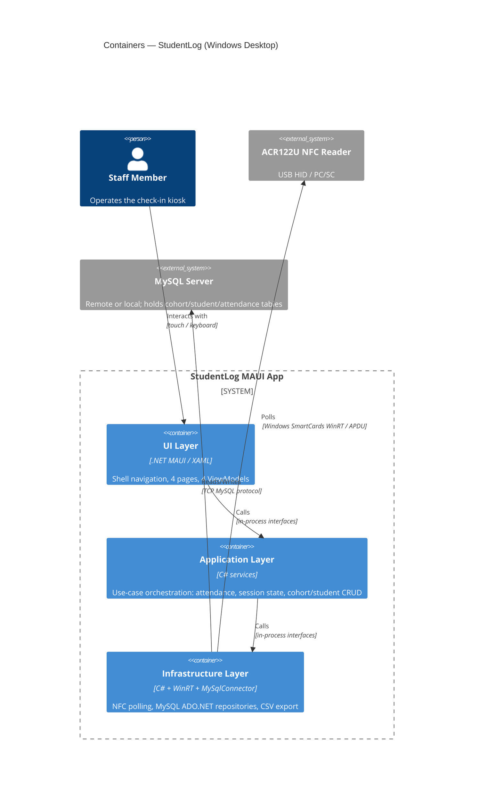

# StudentLog Architecture Review

**Reviewed:** 2026-05-15  
**Reviewer:** Architect Agent  
**Codebase commit:** 860b547 (added export function to filters)

---

## Current State

### What the App Does

StudentLog is a Windows 10+ desktop application that manages student attendance via NFC card scanning. A staff member selects a cohort and a session type (Clock In or Clock Out), then starts a session. The ACR122U NFC reader polls for card taps every 200 ms; each scan is matched to a student record and written to a MySQL database. The UI also supports manual student registration (with optional NFC UID scan), cohort management, per-student attendance history, and CSV export.

### Tech Stack Summary

| Concern | Choice |
|---|---|
| UI framework | .NET MAUI 10, Shell navigation |
| MVVM toolkit | CommunityToolkit.Mvvm 8.4 (ObservableObject, RelayCommand, WeakReferenceMessenger) |
| Database | Remote MySQL via MySqlConnector 2.4 (raw ADO.NET, no ORM) |
| NFC hardware | ACR122U reader via Windows.Devices.SmartCards WinRT API |
| CSV export | CsvHelper 33.1 with Windows FileSavePicker |
| Target | Windows only (TargetFrameworks has only net10.0-windows; iOS/Android/Mac targets appear in obj but not in the .csproj) |

---

## Project Structure

The project lives in a single .csproj (`StudentLog/StudentLog.csproj`) inside a single-project solution (`StudentLog.slnx`). Source files are organised into a layered namespace hierarchy that maps directly to folders:

```
StudentLog/
├── Core/
│   ├── Models/           # Domain entities and value objects
│   │   ├── Student.cs
│   │   ├── Cohort.cs
│   │   ├── AttendanceRecord.cs
│   │   ├── AttendanceScanResult.cs   (sealed result type)
│   │   └── SessionType.cs            (enum)
│   └── Interfaces/
│       └── Repositories/
│           ├── ICohortRepository.cs
│           └── IStudentRepository.cs
├── Application/
│   ├── Interfaces/       # Use-case service contracts
│   │   ├── IAttendanceService.cs
│   │   ├── ICohortService.cs
│   │   ├── IStudentService.cs
│   │   ├── INfcService.cs
│   │   ├── ISessionStateService.cs
│   │   └── ICsvExportService.cs
│   ├── Services/         # Use-case implementations
│   │   ├── AttendanceService.cs
│   │   ├── CohortService.cs
│   │   ├── StudentService.cs
│   │   └── SessionStateService.cs
│   └── Csv/
│       └── AttendanceRecordMap.cs    (CsvHelper class map)
├── Infrastructure/
│   ├── Data/
│   │   ├── IDbConnectionFactory.cs
│   │   ├── MySqlConnectionFactory.cs
│   │   ├── MySqlOptions.cs           (connection config — credentials hardcoded)
│   │   └── DatabaseInitializer.cs    (CREATE TABLE + seed data)
│   ├── Repositories/
│   │   ├── CohortRepository.cs
│   │   └── StudentRepository.cs
│   └── Services/
│       └── NfcService.cs             (Windows WinRT polling loop)
├── UI/
│   ├── ViewModels/
│   │   ├── CheckInSessionViewModel.cs
│   │   ├── CohortsViewModel.cs
│   │   ├── StudentsViewModel.cs
│   │   └── StudentHistoryViewModel.cs
│   ├── Views/
│   │   ├── CheckInSessionPage.xaml/.cs
│   │   ├── CohortsPage.xaml/.cs
│   │   ├── StudentsPage.xaml/.cs
│   │   └── StudentHistoryPage.xaml/.cs
│   ├── Messaging/
│   │   └── AttendanceRecordedMessage.cs
│   └── Converters/
│       ├── SignInStatusConverter.cs
│       └── StringToBoolConverter.cs
├── Platforms/
│   └── Windows/
│       ├── App.xaml/.cs              (WinUI host)
│       └── CsvExportService.cs       (platform-specific export)
├── App.xaml.cs                       (MAUI Application, DB init)
├── AppShell.xaml/.cs                 (Shell + route registration)
└── MauiProgram.cs                    (DI composition root)
```

---

## Key Components

| Class | Layer | Responsibility |
|---|---|---|
| `MauiProgram` | Composition root | Wires the DI container; all registrations are here |
| `App` | Application host | Creates the Window, kicks off async DB init, registers global exception handlers |
| `AppShell` | UI | Shell navigation host; registers the `studenthistory` deep-link route |
| `MySqlOptions` | Infrastructure | Holds hardcoded connection string values (server, port, DB, credentials) |
| `MySqlConnectionFactory` | Infrastructure | Opens a new `MySqlConnection` per call; no pooling management |
| `DatabaseInitializer` | Infrastructure | DDL for three tables (cohort, student, attendance) + seed data on first run |
| `CohortRepository` / `StudentRepository` | Infrastructure | Raw ADO.NET queries; manual reader-to-model mapping |
| `AttendanceService` | Application | Core business logic: validates session, resolves student by UID, writes clock-in/out to both the `student` row and the `attendance` table |
| `SessionStateService` | Application | In-memory singleton holding the active cohort, session type, and date |
| `NfcService` | Infrastructure | Polls the ACR122U via Windows SmartCards WinRT API in a `Task.Run` background loop every 200 ms; invokes a callback on each new UID |
| `CsvExportService` | Platform (Windows) | Opens a `FileSavePicker`, writes a UTF-8 BOM CSV with CsvHelper |
| `CheckInSessionViewModel` | UI | Orchestrates session lifecycle: loads cohorts, starts/stops NFC listener, relays scans to `AttendanceService`, publishes `AttendanceRecordedMessage` |
| `CohortsViewModel` | UI | Manages cohort list, attendance filter (Day/Month/Year), and cohort-level CSV export; receives `AttendanceRecordedMessage` to auto-refresh |
| `StudentsViewModel` | UI | CRUD for students; triggers NFC single-scan for UID capture; navigates to history via Shell route |
| `StudentHistoryViewModel` | UI | Loads and displays per-student attendance history; per-student CSV export |
| `AttendanceScanResult` | Core | Sealed discriminated-union-style result type for scan outcomes (success, not-in-cohort, session inactive, error) |
| `AttendanceRecordedMessage` | UI/Messaging | WeakReferenceMessenger payload sent after a successful scan; carries cohort ID and timestamp |

---

## Data Flow

### NFC Scan to Clock-In/Out Record (happy path)

```
ACR122U hardware
      |
      | Windows SmartCards WinRT
      v
NfcService.TryReadUidFromAcr122uAsync()          [Infrastructure]
  - DeviceInformation.FindAllAsync()
  - SmartCardReader.FindAllCardsAsync()
  - APDU command: FF CA 00 00 00  (GET UID)
  - Returns hex UID string
      |
      | 200 ms polling loop (Task.Run background thread)
      v
NfcService._listeningTask  ->  onUidScanned(uid) callback
      |
      | crosses thread boundary; callback runs on Task.Run thread
      v
CheckInSessionViewModel  (lambda passed to StartListeningAsync)
  - calls AttendanceService.RecordScanAsync(sessionType, uid)
      |
      v
AttendanceService.RecordScanAsync()              [Application]
  1. Guard: ISessionStateService.IsSessionActive
  2. Normalize UID: uid.Trim().ToUpperInvariant()
  3. StudentRepository.GetByUidAsync(uid)         [Infrastructure -> MySQL]
  4. Guard: student.CohortId == ActiveCohortId
  5. Compute timestamp from ActiveDay + DateTime.Now time component
  6. StudentRepository.UpdateAttendanceAsync()    [UPDATE student SET SignInTime/SignOutTime]
  7. StudentRepository.UpsertDailyAttendanceAsync() [INSERT/UPDATE attendance table]
  8. StudentRepository.GetByUidAsync() again (refresh)
  9. Return AttendanceScanResult.Recorded(refreshedStudent, sessionType, timestamp)
      |
      v
CheckInSessionViewModel  (callback continues)
  - MainThread.BeginInvokeOnMainThread()
  - Updates StatusMessage, LastScannedStudentName
  - WeakReferenceMessenger.Default.Send(AttendanceRecordedMessage)
      |
      v
CohortsViewModel  (registered listener)
  - Updates SelectedSessionDate
  - Calls LoadStudentsForSelectedAsync()  -> StudentRepository -> MySQL
      |
      v
UI bindings update CollectionView
```

### Attendance Dual-Write Pattern

`AttendanceService` writes to two tables on every scan:
- `student.SignInTime` / `student.SignOutTime` — a single running "current" state per student (overwritten each session)
- `attendance.SignInTime` / `attendance.SignOutTime` keyed on `(StudentId, SessionDate)` — the historical record

This is the source of the most significant data integrity issue described in the Issues section below.

---

## Architectural Issues

### Issue 1 — CRITICAL: Hardcoded Production Credentials in Source Code

**Severity: High**  
**File:** `StudentLog/Infrastructure/Data/MySqlOptions.cs`, lines 6-10

```
public string Server { get; init; } = "127.0.0.1";
public int Port    { get; init; } = 3307;
public string Database { get; init; } = "student_logDb";
public string UserId   { get; init; } = "root";
public string Password { get; init; } = "FIL2026";
```

The MySQL root password is a compile-time constant baked into the binary and committed to the repository. Any person with access to the built EXE or the git history has the database password. Using the `root` account (vs. a least-privilege application account) compounds the risk.

**Remediation:** Load connection parameters from a local configuration file (e.g., `appsettings.json` excluded from git via `.gitignore`, or `dotnet user-secrets` for development) using `Microsoft.Extensions.Configuration`. Inject `IConfiguration` into `MySqlOptions` or replace the class with an `IOptions<MySqlOptions>` pattern bound from configuration. Use a dedicated non-root MySQL user with only the permissions the application needs (SELECT, INSERT, UPDATE, DELETE on the application database).

---

### Issue 2 — HIGH: IDbConnectionFactory Return Type Leaks Infrastructure Dependency into the Abstraction Layer

**Severity: High**  
**File:** `StudentLog/Infrastructure/Data/IDbConnectionFactory.cs`, line 7

```csharp
public interface IDbConnectionFactory
{
    Task<MySqlConnection> CreateOpenConnectionAsync(CancellationToken cancellationToken = default);
}
```

The interface is declared in the `Infrastructure.Data` namespace and returns a concrete `MySqlConnection`. Code that depends on this interface is coupled to MySqlConnector at compile time, defeating the purpose of the abstraction. The Dependency Rule (*Clean Architecture*, Martin) states that inner layers must not name outer-layer types. If the interface lived in `Core` or `Application` and returned `System.Data.IDbConnection`, the MySQL dependency would be fully contained in Infrastructure.

**Remediation:** Move `IDbConnectionFactory` to `Core.Interfaces` (or `Application.Interfaces`). Change the return type to `Task<System.Data.IDbConnection>`. All repository code already uses only standard ADO.NET operations via `MySqlCommand` and `MySqlDataReader`; updating those to `IDbCommand` / `IDataReader` would complete the inversion. Alternatively, if the team finds raw ADO.NET abstractions too verbose, adopting Dapper (which works against `IDbConnection`) would solve the same problem without an ORM.

---

### Issue 3 — HIGH: Attendance Dual-Write Is Not Atomic (Data Integrity Risk)

**Severity: High**  
**Files:** `StudentLog/Application/Services/AttendanceService.cs`, lines 43-64; `StudentLog/Infrastructure/Repositories/StudentRepository.cs`, lines 104-153

`AttendanceService.RecordScanAsync` makes two sequential writes:
1. `StudentRepository.UpdateAttendanceAsync` — updates `student.SignInTime`/`student.SignOutTime`
2. `StudentRepository.UpsertDailyAttendanceAsync` — upserts `attendance` row

Each write opens its own connection. If the application crashes, the network drops, or MySQL rejects the second write, the two tables are left inconsistent. Additionally, the `student` table carrying `SignInTime`/`SignOutTime` duplicates state that belongs exclusively in the `attendance` table; this denormalisation is the root cause of the dual-write.

**Remediation (short term):** Wrap both writes in a single MySQL transaction using one shared connection. Modify `IStudentRepository` to accept an optional `IDbTransaction` parameter, or add a `UnitOfWork`/`IDbContext` abstraction that the service can use to commit atomically.

**Remediation (longer term):** Remove `SignInTime` and `SignOutTime` from the `student` table entirely. The `attendance` table is the source of truth. Views that currently read these fields from the `student` row should instead join or query `attendance`. This eliminates the dual-write entirely.

---

### Issue 4 — HIGH: NfcService Polls Device Discovery on Every Scan Iteration

**Severity: High**  
**File:** `StudentLog/Infrastructure/Services/NfcService.cs`, lines 210-244

`TryReadUidFromAcr122uAsync` is called every 200 ms inside the polling loop. Every call executes:
```csharp
var selector = SmartCardReader.GetDeviceSelector();
var devices  = await DeviceInformation.FindAllAsync(selector);  // full device enumeration
```

`DeviceInformation.FindAllAsync` is a WinRT bus scan. Running it 5 times per second is wasteful, and the documentation recommends `DeviceWatcher` for continuous monitoring. Under sustained load this pattern will also create and discard `SmartCardReader` objects at 5 Hz without an explicit disposal path (the `readers` list goes out of scope).

**Remediation:** Initialise the reader once when `StartListeningAsync` is called (or lazily on first scan). Use `DeviceWatcher` to receive addition/removal events. Cache the resolved `SmartCardReader` reference for the lifetime of the session. Only re-enumerate when the watcher fires a removal event.

---

### Issue 5 — MEDIUM: SessionStateService Is a Mutable Singleton With No Thread-Safety Guarantees

**Severity: Medium**  
**File:** `StudentLog/Application/Services/SessionStateService.cs`

`SessionStateService` is registered as a `Singleton`. Its properties are written by the UI thread (via `StartSession`/`StopSession` called from the ViewModel) and read by the NFC background loop (via `AttendanceService.RecordScanAsync`). There are no locks, `volatile` declarations, or `Interlocked` operations. On ARM architectures or under JIT reordering, reads in the background thread could observe a partially-updated state (e.g., `IsSessionActive == true` but `ActiveCohortId == null`).

**Remediation:** Make the mutable state an immutable record (`SessionSnapshot`) swapped atomically via `Interlocked.Exchange` on a reference field, or introduce a simple `lock` around reads and writes. Given the low write frequency (user-initiated only), a `lock` is the simplest safe solution.

---

### Issue 6 — MEDIUM: StopListeningAsync Blocks the Calling Thread

**Severity: Medium**  
**File:** `StudentLog/Infrastructure/Services/NfcService.cs`, lines 144-157

```csharp
_listeningTask.Wait(TimeSpan.FromSeconds(2));
```

`Task.Wait` on an async method called from a UI-context `async void` chain can cause a deadlock on the MAUI main thread dispatcher if the task continuation needs to marshal back to that thread. Even when it does not deadlock, it blocks the calling thread for up to 2 seconds, which will freeze the UI.

**Remediation:** Replace `_listeningTask.Wait(...)` with `await _listeningTask.WaitAsync(TimeSpan.FromSeconds(2), cancellationToken)` (available in .NET 6+). The method is already declared `Task`-returning, so the await is valid. Ensure `StopListeningAsync` is awaited at all call sites.

---

### Issue 7 — MEDIUM: Filtering Logic Is In-Process But Relies on Stale student-Level Timestamps

**Severity: Medium**  
**File:** `StudentLog/UI/ViewModels/CohortsViewModel.cs`, lines 186-250

When the scope filter is "Month" or "Year", `LoadStudentsForSelectedAsync` fetches all students in the cohort and then filters client-side using `HasAttendanceForFilter`, which compares `student.SignInTime`/`student.SignOutTime`. These are the columns on the `student` table, not the `attendance` table. Because a single student row holds only one pair of timestamps (the most recent session), Month and Year filters only ever reflect the most recent day's attendance, not the full period. This is a silent correctness bug.

**Remediation:** Once Issue 3's longer-term fix removes timestamps from `student`, Month and Year queries must be pushed to the database via the `attendance` table (e.g., `WHERE YEAR(SessionDate) = @year`). Introduce `IStudentRepository.GetByCohortAndPeriodAsync(int cohortId, DateOnly from, DateOnly to)` and move filtering to SQL.

---

### Issue 8 — MEDIUM: NfcService.ScanSingleUidAsync Reaches Into the UI Layer

**Severity: Medium**  
**File:** `StudentLog/Infrastructure/Services/NfcService.cs`, lines 186-194

```csharp
var manualUid = await MainThread.InvokeOnMainThreadAsync(async () =>
    await Microsoft.Maui.Controls.Application.Current!.Windows[0].Page!.DisplayPromptAsync(
        "Scan NFC", ...));
```

An Infrastructure service is directly calling `Application.Current.Windows[0].Page.DisplayPromptAsync`, which is a UI concern. This violates the Dependency Rule: Infrastructure should not reference the UI layer. It also makes the service untestable and couples it to a specific page hierarchy.

**Remediation:** Introduce an `IDialogService` interface in the `Application.Interfaces` namespace with a method like `Task<string?> PromptAsync(string title, string message, ...)`. Implement it in the UI layer (`UI/Services/MauiDialogService.cs`). Register it in `MauiProgram`. Inject `IDialogService` into `NfcService` (or, preferably, keep this fallback prompt entirely in the ViewModel where it belongs: have `INfcService.ScanSingleUidAsync` return `null` on timeout, and let the ViewModel decide to prompt the user).

---

### Issue 9 — MEDIUM: ViewModels Are Not Using Source-Generated ObservableProperty

**Severity: Medium**  
**Files:** All ViewModel classes

The project takes a dependency on CommunityToolkit.Mvvm, which includes Roslyn source generators for `[ObservableProperty]` and `[RelayCommand]`. None of the four ViewModels use these generators; instead, all properties are hand-written with backing fields and `SetProperty` calls, and all commands are manually instantiated in constructors. This is not a bug, but it creates significant boilerplate (StudentsViewModel alone has 11 hand-written observable properties and 8 command declarations spanning ~120 lines of ceremony). The source generators would reduce this to annotated fields and methods, improving signal-to-noise ratio and lowering the chance of a missed `SetProperty` call.

**Remediation:** Convert ViewModels to `partial class`, replace backing fields with `[ObservableProperty]`-annotated fields, and replace `IAsyncRelayCommand` field + constructor wiring with `[RelayCommand]`-annotated methods. This is a purely mechanical refactor with no behaviour change.

---

### Issue 10 — MEDIUM: AttendanceService Makes a Third Database Round-Trip to Refresh the Student After Writing

**Severity: Medium**  
**File:** `StudentLog/Application/Services/AttendanceService.cs`, lines 66-71

After the two writes, `RecordScanAsync` immediately calls `GetByUidAsync` again to return a refreshed student to the caller. The service already has all the data needed to construct the refreshed state without a network round-trip: it knows which timestamps were written. At 200 ms polling intervals with a remote MySQL instance, this third round-trip adds latency to every scan.

**Remediation:** After writing, manually update the `student` object in memory:
```csharp
if (sessionType == SessionType.ClockIn)
    student.SignInTime = timestamp;
else
    student.SignOutTime = timestamp;
return AttendanceScanResult.Recorded(student, sessionType, timestamp);
```
Remove the `GetByUidAsync` re-fetch at lines 66-71.

---

### Issue 11 — MEDIUM: DatabaseInitializer Contains Seed Data Appropriate Only for Development

**Severity: Medium**  
**File:** `StudentLog/Infrastructure/Data/DatabaseInitializer.cs`, lines 63-104

The initialiser seeds three students with hardcoded UIDs and names into a production application on first run. Seed data with real-looking card UIDs should never ship to production. On a fresh install at a new institution, the database will contain phantom students that must be manually deleted.

**Remediation:** Extract seeding into a separate development-only mechanism (e.g., a `#if DEBUG` guard or a separate `DatabaseSeeder` class invoked only from a developer tooling entry point). The `DatabaseInitializer` itself should only run DDL, not DML.

---

### Issue 12 — LOW: CohortsViewModel Constructs AttendanceRecord Objects From Student Properties for Export

**Severity: Low**  
**File:** `StudentLog/UI/ViewModels/CohortsViewModel.cs`, lines 149-156

The export path projects `Student` objects into `AttendanceRecord` objects inside the ViewModel using a LINQ Select. This projection duplicates the mapping concern already present in `AttendanceRecord` and couples the ViewModel to both domain types. It also uses `student.SignInTime`/`student.SignOutTime` (the stale student-table timestamps, see Issue 7) rather than the per-day attendance records.

**Remediation:** After Issue 3's fix, the export should fetch `AttendanceRecord` objects directly from `IStudentService.GetAttendanceHistoryAsync` (filtered by date range) rather than re-projecting from `Student`.

---

### Issue 13 — LOW: No IDisposable / Lifetime Management for NfcService

**Severity: Low**  
**File:** `StudentLog/Infrastructure/Services/NfcService.cs`

`NfcService` holds a `CancellationTokenSource` and a background `Task`. It is registered as a `Singleton`. If the application's DI container is disposed (e.g., on Window close) while the NFC loop is still running, the `CancellationTokenSource` is never cancelled and the background task leaks until the process exits. The class should implement `IAsyncDisposable` and cancel and await the background task on disposal.

---

### Issue 14 — LOW: Logging Uses Debug.WriteLine Throughout

**Severity: Low**  
**Files:** All service and repository classes (approximately 50 call sites)

All diagnostic output uses `System.Diagnostics.Debug.WriteLine`, which is stripped in Release builds and is invisible in any structured log aggregator. The project already references `Microsoft.Extensions.Logging.Debug`. Replacing `Debug.WriteLine` calls with `ILogger<T>` injected via DI would allow log level filtering, structured output, and swappable log sinks (e.g., file, Seq, Application Insights) without changing call sites.

---

## Recommended Architecture

The codebase already exhibits the correct layered intent (Core / Application / Infrastructure / UI). The recommended target architecture preserves that skeleton and addresses the issues above with minimal structural disruption.

### Layer Breakdown (Target)

```
Core  (no dependencies on any other layer)
  Models/         — Student, Cohort, AttendanceRecord, AttendanceScanResult, SessionType
                    NOTE: Remove SignInTime/SignOutTime from Student (Issue 3 long-term)
  Interfaces/
    Repositories/ — ICohortRepository, IStudentRepository
                    IDbConnectionFactory moves here, returns IDbConnection (Issue 2)

Application  (depends only on Core)
  Interfaces/     — IAttendanceService, ICohortService, IStudentService, INfcService,
                    ISessionStateService, ICsvExportService
                    + IDialogService (new, Issue 8)
  Services/       — AttendanceService (atomise writes, Issue 3), CohortService,
                    StudentService, SessionStateService (thread-safe, Issue 5)
  Csv/            — AttendanceRecordMap (stays here; CsvHelper is an application concern)

Infrastructure  (depends on Core; never on UI)
  Data/           — MySqlConnectionFactory (returns IDbConnection), MySqlOptions (loaded
                    from config, Issue 1), DatabaseInitializer (DDL only, Issue 11)
  Repositories/   — CohortRepository, StudentRepository (transactions for Issue 3)
  Services/       — NfcService (DeviceWatcher, Issue 4; IDisposable, Issue 13)

UI  (depends on Application and Core; never on Infrastructure directly)
  ViewModels/     — source-generated ObservableProperty/RelayCommand (Issue 9)
                    CheckInSessionViewModel, CohortsViewModel, StudentsViewModel,
                    StudentHistoryViewModel
  Views/          — XAML pages (no logic changes needed)
  Services/       — MauiDialogService (implements IDialogService, Issue 8)
  Converters/     — SignInStatusConverter, StringToBoolConverter
  Messaging/      — AttendanceRecordedMessage

Platforms/Windows/
  App.xaml.cs     — WinUI host
  CsvExportService — platform-specific file picker (stays here; correct location)

Configuration (new)
  appsettings.json (gitignored)  — connection string, credentials
  appsettings.Development.json   — overrides for dev
```

### Key Abstractions to Introduce

1. **`IDialogService`** in `Application.Interfaces` — decouples NfcService and ViewModels from MAUI's `DisplayPromptAsync`
2. **`IDbConnection`-returning `IDbConnectionFactory`** in `Core.Interfaces` — removes MySqlConnector from the abstraction
3. **`IDbTransaction` or Unit-of-Work** — enables atomic dual-write (or single-write after denorm removal)
4. **`SessionSnapshot` record** — immutable value type replacing mutable `SessionStateService` properties, exchanged atomically

---

## Implementation Roadmap

Items are ordered by risk/impact. Each item names the files affected and why the change matters.

---

### Priority 1 — Security: Externalise Credentials (Issue 1)

**What:** Replace hardcoded values in `MySqlOptions` with values read from `appsettings.json` via `Microsoft.Extensions.Configuration`.

**Why:** A root MySQL password must never be in source control or a compiled binary.

**Files affected:**
- `StudentLog/Infrastructure/Data/MySqlOptions.cs` — convert to a POCO with no defaults; bind via `IOptions<MySqlOptions>`
- `StudentLog/MauiProgram.cs` — add `IConfiguration` setup, bind `MySqlOptions`, register as `IOptions<MySqlOptions>`
- New file: `StudentLog/appsettings.json` (excluded from git)
- `.gitignore` — add `StudentLog/appsettings.json` entry

**Implementation note:** Use `Microsoft.Extensions.Configuration.Json` to load `appsettings.json` from the app package directory. The `MySqlConnectionFactory` constructor changes from `MySqlOptions` to `IOptions<MySqlOptions>`.

---

### Priority 2 — Data Integrity: Atomic Attendance Write (Issue 3, short-term path)

**What:** Wrap the two writes in `AttendanceService.RecordScanAsync` inside a single transaction.

**Why:** A crash between the two writes leaves `student` and `attendance` inconsistent.

**Files affected:**
- `StudentLog/Application/Services/AttendanceService.cs` — obtain a connection, open a transaction, pass it to both repository calls, commit on success, rollback on exception
- `StudentLog/Core/Interfaces/Repositories/IStudentRepository.cs` — add optional `IDbTransaction?` parameter to `UpdateAttendanceAsync` and `UpsertDailyAttendanceAsync`
- `StudentLog/Infrastructure/Repositories/StudentRepository.cs` — implement transaction parameter; if provided, use it instead of opening a new connection
- `StudentLog/Infrastructure/Data/IDbConnectionFactory.cs` — consider adding `BeginTransactionAsync` or return type change to `IDbConnection` (feeds into Priority 4)

---

### Priority 3 — NFC Reliability: Fix Device Discovery Hot Loop (Issue 4)

**What:** Initialise `SmartCardReader` once when listening starts; use `DeviceWatcher` for plug/unplug events; only re-resolve on a removal event.

**Why:** Running `DeviceInformation.FindAllAsync` 5 times per second is a bus scan; it will degrade performance and potentially interfere with other USB devices. The current code also leaks `SmartCardReader` objects.

**Files affected:**
- `StudentLog/Infrastructure/Services/NfcService.cs` — add `_reader` field; initialise in `StartListeningAsync`; call `_reader.FindAllCardsAsync()` in the polling loop (not device discovery); add `IAsyncDisposable` implementation (feeds Priority 7)

---

### Priority 4 — Correctness: Fix Month/Year Filter Using Attendance Table (Issues 7 and 3 long-term)

**What:** Add a date-range query to the repository; remove `SignInTime`/`SignOutTime` from the `student` table.

**Why:** Month/Year filters currently show wrong data because they read the single timestamp stored on the `student` row rather than the full attendance history.

**Files affected:**
- `StudentLog/Core/Interfaces/Repositories/IStudentRepository.cs` — add `GetByCohortAndPeriodAsync(int cohortId, DateOnly from, DateOnly to, ...)`
- `StudentLog/Infrastructure/Repositories/StudentRepository.cs` — implement the query against `attendance`
- `StudentLog/Application/Interfaces/IStudentService.cs` — add corresponding service method
- `StudentLog/Application/Services/StudentService.cs` — delegate to new repository method
- `StudentLog/UI/ViewModels/CohortsViewModel.cs` — replace in-process `HasAttendanceForFilter` with service call; remove `MatchesSelectedPeriod` helper
- `StudentLog/Infrastructure/Data/DatabaseInitializer.cs` — migration to drop `SignInTime`/`SignOutTime` columns from `student` table (once all reads/writes are migrated)
- `StudentLog/Core/Models/Student.cs` — remove `SignInTime` and `SignOutTime` properties

---

### Priority 5 — Architecture: Move IDbConnectionFactory to Core (Issue 2)

**What:** Relocate `IDbConnectionFactory` to `StudentLog/Core/Interfaces/` and change the return type from `MySqlConnection` to `System.Data.IDbConnection`.

**Why:** The current interface is declared in Infrastructure and returns a MySqlConnector type, making Core depend on the Infrastructure assembly at compile time if the interface is referenced from Application services.

**Files affected:**
- `StudentLog/Infrastructure/Data/IDbConnectionFactory.cs` — delete (or keep as an internal alias)
- New file: `StudentLog/Core/Interfaces/IDbConnectionFactory.cs` — `Task<IDbConnection> CreateOpenConnectionAsync(...)`
- `StudentLog/Infrastructure/Data/MySqlConnectionFactory.cs` — implement the Core interface; cast remains internal
- `StudentLog/Infrastructure/Repositories/CohortRepository.cs`, `StudentRepository.cs` — update `using` directives

---

### Priority 6 — Security/Architecture: Decouple NfcService From the UI (Issue 8)

**What:** Extract the `DisplayPromptAsync` call from `NfcService.ScanSingleUidAsync` into a ViewModel-level fallback using `IDialogService`.

**Why:** Infrastructure must not call into MAUI UI APIs; it makes the service untestable and violates the Dependency Rule.

**Files affected:**
- New file: `StudentLog/Application/Interfaces/IDialogService.cs` — `Task<string?> PromptAsync(string title, string message, string accept, string cancel, string? placeholder)`
- New file: `StudentLog/UI/Services/MauiDialogService.cs` — implement using `Application.Current.Windows[0].Page.DisplayPromptAsync`
- `StudentLog/MauiProgram.cs` — register `MauiDialogService` as `IDialogService`
- `StudentLog/Infrastructure/Services/NfcService.cs` — `ScanSingleUidAsync` returns `null` on timeout; remove `MainThread.InvokeOnMainThreadAsync` call
- `StudentLog/UI/ViewModels/StudentsViewModel.cs` — inject `IDialogService`; after `ScanSingleUidAsync` returns `null`, call `IDialogService.PromptAsync`

---

### Priority 7 — Thread Safety: Fix SessionStateService and NfcService Lifetime (Issues 5, 13)

**What:** Add thread safety to `SessionStateService`; implement `IAsyncDisposable` on `NfcService`.

**Why:** The NFC background thread reads session state concurrently with UI thread writes; on multicore hardware this is a data race. `NfcService` leaks a background task on shutdown.

**Files affected:**
- `StudentLog/Application/Services/SessionStateService.cs` — add `private readonly object _lock = new(); ` and wrap reads/writes, or replace mutable properties with an `Interlocked`-swapped immutable `SessionSnapshot` record
- `StudentLog/Infrastructure/Services/NfcService.cs` — implement `IAsyncDisposable.DisposeAsync`: cancel CTS, await task, dispose CTS
- `StudentLog/MauiProgram.cs` — no registration change needed; DI container calls `DisposeAsync` on singleton disposables automatically

---

### Priority 8 — Maintainability: Source-Generate ViewModel Boilerplate (Issue 9)

**What:** Convert all four ViewModels to `partial class` and annotate observable properties with `[ObservableProperty]` and async command methods with `[RelayCommand]`.

**Why:** Eliminates ~200 lines of mechanical boilerplate; reduces the risk of missing a `SetProperty` call; keeps ViewModels focused on logic rather than plumbing.

**Files affected:**
- `StudentLog/UI/ViewModels/CheckInSessionViewModel.cs`
- `StudentLog/UI/ViewModels/CohortsViewModel.cs`
- `StudentLog/UI/ViewModels/StudentsViewModel.cs`
- `StudentLog/UI/ViewModels/StudentHistoryViewModel.cs`

**Note:** The ViewModel base class must change from `ObservableObject` to remain `ObservableObject` (source generators work with `ObservableObject`). The class declaration must become `partial`. No behaviour changes.

---

### Priority 9 — Observability: Replace Debug.WriteLine With ILogger (Issue 14)

**What:** Inject `ILogger<T>` into all service and repository classes; replace all `System.Diagnostics.Debug.WriteLine` calls with structured log calls at appropriate levels (`LogDebug`, `LogInformation`, `LogWarning`, `LogError`).

**Why:** Debug output is invisible in Release builds and non-structured; structured logging enables filtering, sink swapping, and post-incident analysis.

**Files affected (approximately 8 classes):**
- `StudentLog/Infrastructure/Services/NfcService.cs`
- `StudentLog/Infrastructure/Repositories/StudentRepository.cs`
- `StudentLog/Application/Services/AttendanceService.cs`
- `StudentLog/Infrastructure/Data/DatabaseInitializer.cs`
- `StudentLog/UI/ViewModels/CheckInSessionViewModel.cs`
- `StudentLog/UI/ViewModels/CohortsViewModel.cs`
- `StudentLog/UI/ViewModels/StudentHistoryViewModel.cs`
- `StudentLog/App.xaml.cs`

The `Microsoft.Extensions.Logging.Debug` package is already referenced; no new NuGet dependency is required for development. For production, add a file sink (e.g., `Microsoft.Extensions.Logging.EventLog` or `Serilog.Sinks.File`) registered in `MauiProgram`.

---

### Priority 10 — Data Quality: Remove Dev Seed Data From Production Initializer (Issue 11)

**What:** Move the `SeedTestDataAsync` call out of `DatabaseInitializer.InitializeAsync` and into a `#if DEBUG`-gated or explicitly invoked path.

**Why:** On a fresh install, three phantom students with hardcoded UIDs are inserted, which must then be manually removed.

**Files affected:**
- `StudentLog/Infrastructure/Data/DatabaseInitializer.cs` — remove `await SeedTestDataAsync(...)` from `InitializeAsync`, or wrap entire seed block in `#if DEBUG`

---

### Priority 11 — Performance: Eliminate Redundant Re-Fetch in AttendanceService (Issue 10)

**What:** After writing timestamps, construct the updated `Student` in memory rather than re-querying MySQL.

**Why:** Removes a database round-trip from the hot path (every NFC scan).

**Files affected:**
- `StudentLog/Application/Services/AttendanceService.cs`, lines 66-71 — delete re-fetch; mutate `student` in memory and use directly in `AttendanceScanResult.Recorded`

---

## Architecture Diagrams

### C4 Container Diagram (Current + Target)



### Dependency Flow (Target — arrows point inward, no violations)

```
UI  ──────────────────────────────►  Application  ──────►  Core
                                          │                   ▲
Platforms/Windows/CsvExportService        │                   │
    implements ICsvExportService ─────────┘                   │
                                                              │
Infrastructure  ──────────────────────────────────────────►  Core
    (MySqlConnectionFactory, Repositories, NfcService)
    implements interfaces defined in Core and Application
```
